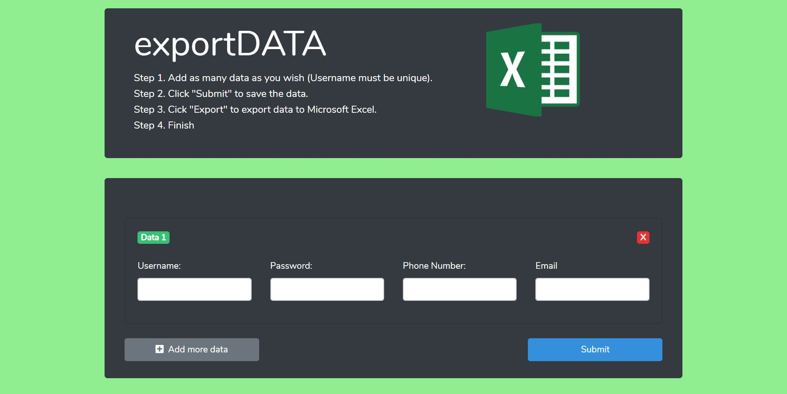

## About exportDATA

exportDATA is a simple web app that allows users to add data on the website and export them to Microsoft Excel.

## Modules

- Add data to database
- Export data to Microsoft Excel

## Language

- Frontend : Vue.JS
- Backend : Laravel

## Screenshot

    &nbsp  &nbsp  &nbsp  &nbsp

